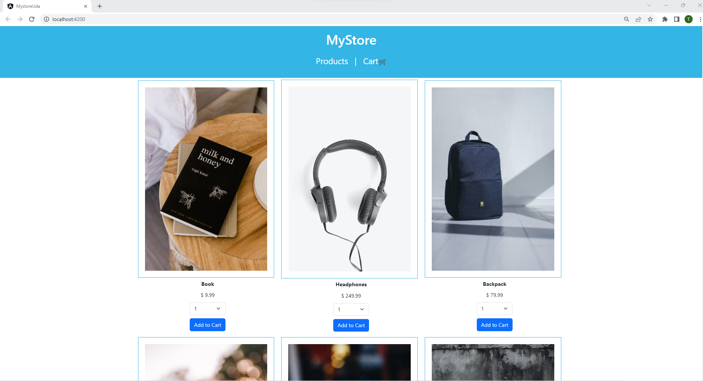
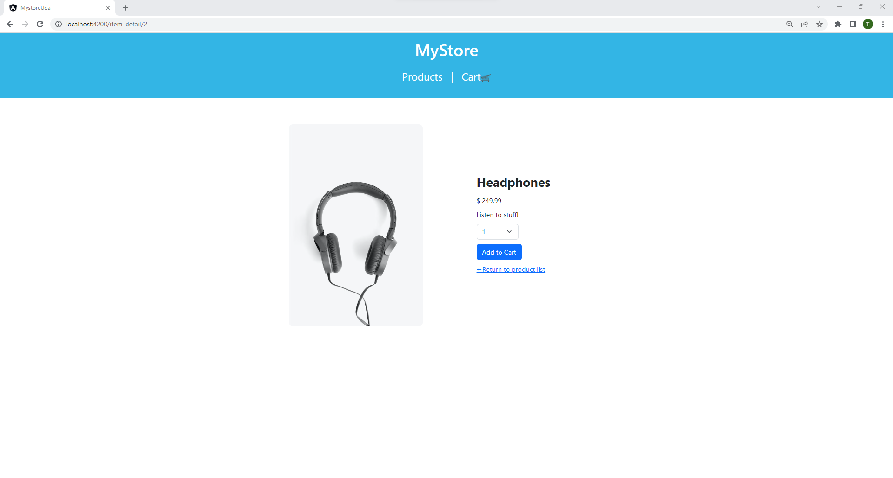
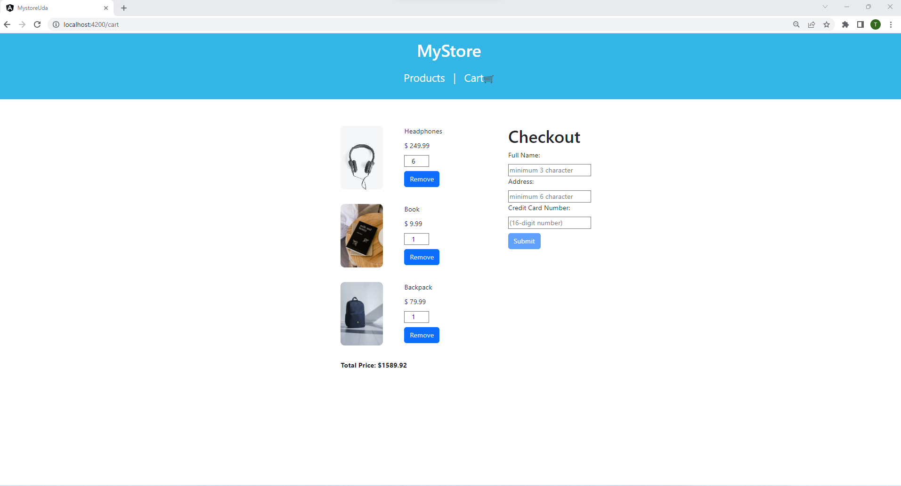
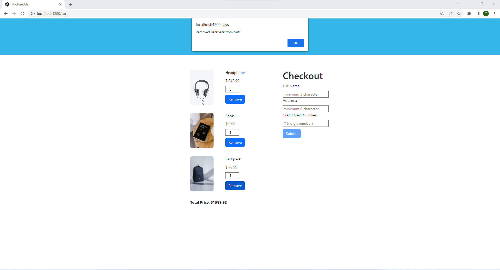
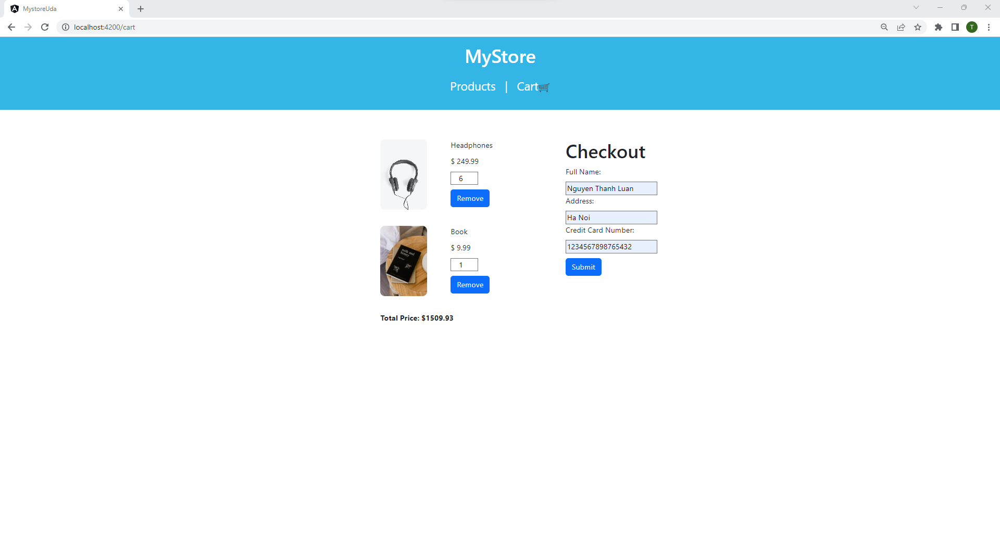
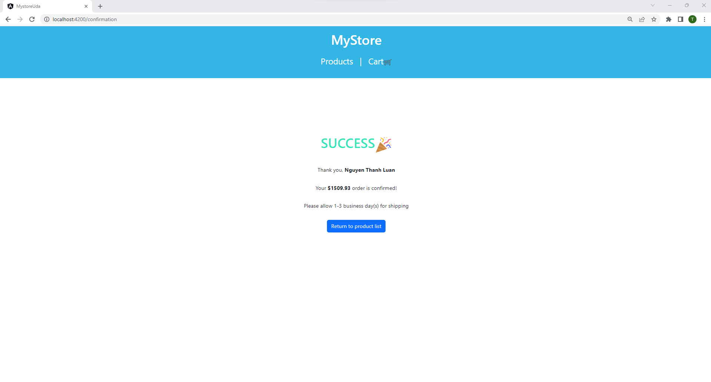
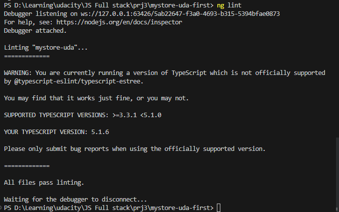

# Udacity MyStore












MyStore is a single-page application  built in Angular, that offers a rich, dynamic experience on the web. It presents a list of product which can be added to a cart then chechout. Bellow are all the functionality one can perform: 

- View list of products
- Add products to cart
- View products in cart
- Delete product from cart 
- Checkout products in cart 


## Run 
### Install Dependencies 
fork this repo and open a terminal at the root directory and run the command 

```
npm install
```

## Start server
On the same terminal, run the command 
```
ng serve
```
Navigate to `http://localhost:4200/`. The app will automatically reload if you change any of the source files.

**NB**: Be sure to allow the default port of `4200`

## Run lint
